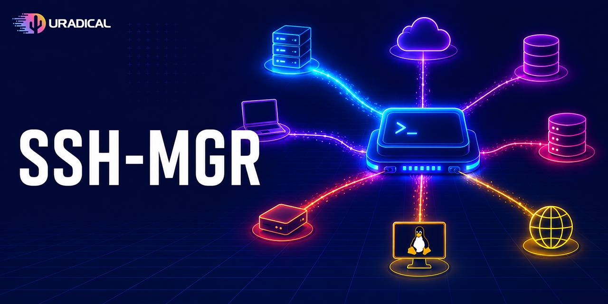

<p align="center">
  
</p>

# ssh-mgr

A terminal UI for managing your `~/.ssh/config` host entries.

`ssh-mgr` reads your existing SSH config, lets you browse, add, edit, clone,
disable, and delete host blocks from a keyboard-driven TUI, test reachability
of a host, and open a connection — all without hand-editing the file.

Built with [Bubble Tea](https://github.com/charmbracelet/bubbletea).

## Features

- **Full-screen host list** of every `Host` block in `~/.ssh/config`, in file order.
- **Add / edit / clone / delete** hosts through a form, with an identity-file picker.
- **Enable / disable** a host without deleting it — disabled blocks are commented
  out in place (using a sentinel marker) so they survive round-trips.
- **Test reachability** with a non-interactive background probe (`BatchMode`,
  5s connect timeout) that never blocks the UI.
- **Connect** to the selected host directly from the list.
- **Safe writes** — the config is regenerated atomically: an exclusive `flock`
  is held while a temp file is written and renamed over the original, so a crash
  mid-write can never leave a truncated config.
- **Themeable** via TOML colour themes (a `dark` theme ships built in).

## Install

### From source

```sh
go install uradical.io/go/sshmgr/cmd/ssh-mgr@latest
```

Or clone and build with the Makefile:

```sh
make build      # builds ./bin/ssh-mgr
make install    # go install ./cmd/ssh-mgr
make run        # go run ./cmd/ssh-mgr
```

Requires Go 1.22+. The build is CGO-free, so cross-compilation is easy;
prebuilt binaries for Linux, macOS, and Windows are produced via
[GoReleaser](https://goreleaser.com/).

## Usage

```sh
ssh-mgr
```

The app opens an alternate-screen TUI over your existing `~/.ssh/config`. A
missing config file is fine (you start with no hosts); a malformed one is shown
as a full-screen error and the file is never touched.

### Key bindings

| Key      | Action                          |
| -------- | ------------------------------- |
| `j` / `k` (or arrows) | Move up / down      |
| `e` / `Enter` | Edit the selected host     |
| `a`      | Add a new host                  |
| `c`      | Clone the selected host         |
| `t`      | Test reachability               |
| `s`      | Connect to the selected host    |
| `d`      | Disable / enable the host       |
| `x`      | Delete the host                 |
| `q`      | Quit                            |

In the edit form, `Esc` cancels, `Enter` saves, and `Space` / `f` opens the
identity-file picker when the identity field is focused.

## Configuration

`ssh-mgr` reads an optional application config from
`~/.config/ssh-mgr/config.toml`:

```toml
theme = "dark"
```

If the file is missing, defaults are used. If it exists but is malformed,
`ssh-mgr` reports the error and exits before starting the TUI.

### Themes

Themes are TOML files of named hex colours. The bundled `dark` theme is used by
default. To add your own, drop a file at
`~/.config/ssh-mgr/themes/<name>.toml` and set `theme = "<name>"` in your
config. A theme defines:

```toml
primary   = "#58a6ff"
secondary = "#..."
success   = "#..."
warning   = "#..."
error     = "#..."
muted     = "#..."
subtle    = "#..."
border    = "#..."
bg_panel  = "#..."
```

A missing or malformed theme silently falls back to the built-in default —
loading a theme never fails.

## Development

```sh
make build     # build to ./bin/ssh-mgr
make run       # run from source
make lint      # golangci-lint if present, else go vet
go test ./...  # run the test suite
make clean     # remove build artifacts
```

### Layout

| Package         | Responsibility                                            |
| --------------- | --------------------------------------------------------- |
| `cmd/ssh-mgr`   | Entry point (`main`): loads config + ssh config, starts the TUI. |
| `config`   | Loads the application config (`config.toml`).             |
| `ssh`      | Reads/writes `~/.ssh/config`, owns the `Host` model, probes reachability. |
| `model`    | The root Bubble Tea model and key handling.               |
| `ui`       | Views: host list, detail, edit form, file picker, modals. |
| `theme`    | Loads colour themes and builds lipgloss styles.           |

## License

Copyright © 2026 uradical.

ssh-mgr is free software: you can redistribute it and/or modify it under the
terms of the [GNU General Public License](LICENSE) as published by the Free
Software Foundation, either version 3 of the License, or (at your option) any
later version. It is distributed in the hope that it will be useful, but
WITHOUT ANY WARRANTY; see the [LICENSE](LICENSE) file for details.
